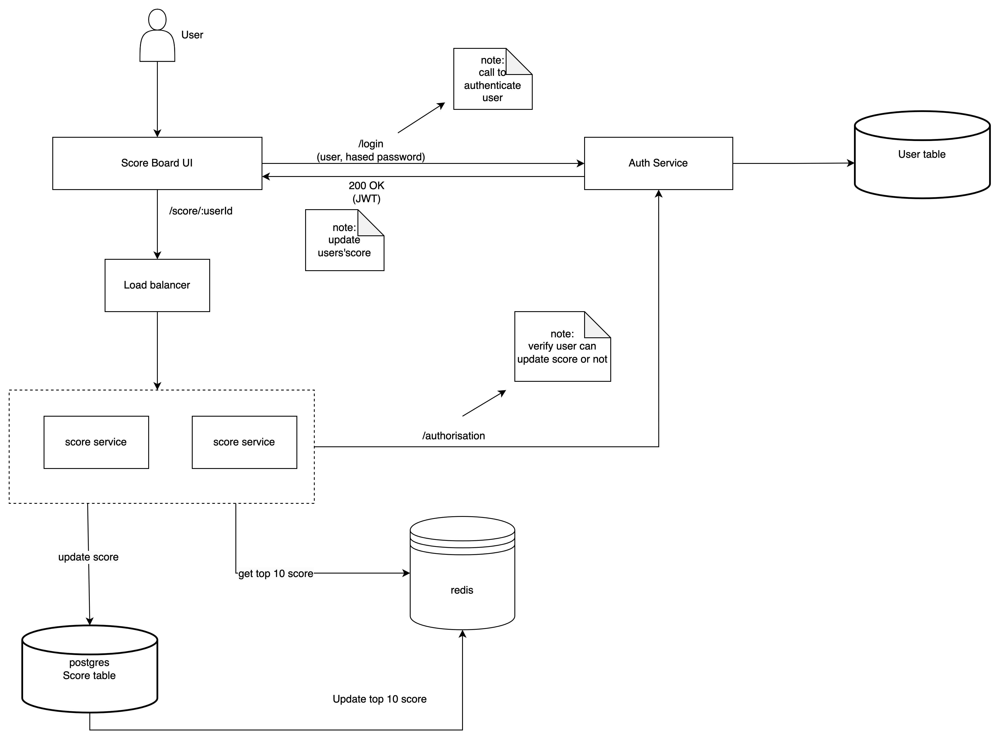
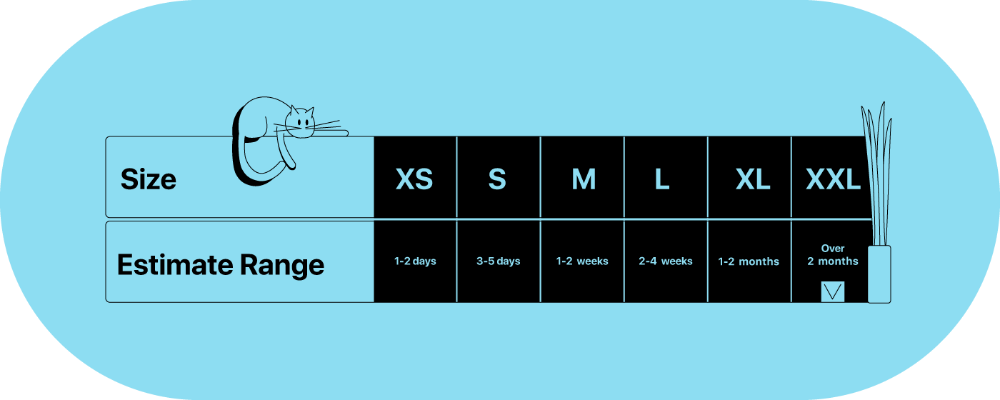

Table of content:

- [Break out requirement](#break-out-requirement)
- [Solution design diagram](#solution-design-diagram)
- [Work break down and estimation](#work-break-down)
- []

## Break out requirement

1. design a live score board server, show top 10 highest score users

- need a postgres database to store score of user
- sql query:

```sql
SELECT userId, score
FROM User
ORDER BY score DESC
LIMIT 10
```

- Create index for score column to boost up query process.
- shard the database bases on some criteria like role of user or location, ... to improve both write and read operation.
- expand connection pool for high QPS.
- caching frequently request: we can use redis to store result of top 10 user scores, whenever database has new update, we can update it back.
- We can adopt with more performance NOSQL database like Cassandra or DynamoDB. But consider because it costs expensive.

2. We want live update of the score board.

- Build an api to update score to database.
- After updating score successfully, we return back result to FE to re-display score and update redis store. We can do both operation simultaneous.
- If return result immediately after updating score of a lot of users sometimes cause some issue like make many query to retrieve top 10 score, it very risk and cost. We can use some mechanism can afford that like: polling, interval, ...

5. We want to prevent malicious users from increasing scores without authorisation.

- A lot of way to do that, i can list out some popular methods like: Token-Based Authen, OAuth,
  Session-Based,
  Certificated-Based,
  Roled-Based
  Access Control
  ,...
- I will pick Token-based Authentication:

  - Stateless: token encapsulates user information, making server stateless and more scalable
  - Security: Token can be signed with crypto algorithm
  - Decoupling Authen and Author
  - Supported by third party

- Build a service named Auth service to authentication and authorisation user
- User login to application by `/login` endpoint with userName and password (hashed) -> verify and return JWT and user information
- When user call api update score `/score/:userId`, we call to Auth service to validate if user can update or not based on information in token.

## Solution design diagram



## Work Break down

I prefer T-shirt sizing to estimate effort to do the task



**_DoD: Definition of done_**

1. Setup/Scaffolding codebase, infrastructure, CI/CD pipeline (**M**)

- Overview we have 2 service: Score service and Auth service
- Initialize and setup skeleton codebase like: setup folder structure, eslint, prettier, typescript, jest, connect database, redis. DoD: 2 service are ready for dev build feature
- Setup infrastructure on aws, HAproxy, CI/CD pipeline. DoD: Service can be deployed, HAproxy work properly, CI/CD pipeline can auto build/test service/deploy service

2. Develop Auth service(**S**)

- After have code base, we build api `/login` to authenticate user:
  - Validate request from user, check if have enough info to precess further like: userName, password,..
  - Call into user table to validate those credentials
  - Sign a token(JWT) and return to user with status 200 OK
  - Store token in redis, because it is a value use quite frequently
- Build api `/logout` to destroy token of user:
  - destroy JWT
  - remove from redis
- Build `/authorisation` to verify user has permission to update score or not
  - Validate request from user, check if have enough info to process further like: token(JWT)
  - Decode JWT and obtain userName, Role, Permission, ...
  - Return 200 OK if user has permission. Otherwise, return 403 forbidden.

3. Develop Score service

- Build `score/:userId` to update score of user
  - Retrieve token from redis, call to Auth service to validate permission to update score
  - Update new score for user into Score table
  - Retrieve top 10 highest scores, return back to FE to re-display score board, and update back to redis
- Build `/score` to display top 10 user's score
  - No need to authorisation to se score board, just login is enough
  - Retrieve result from redis to display

## Sequence Diagram

## Thing needs to improve

- Load/Stress testing for those api
- Plan to handle fault tolerance
- Complete sequence diagram
- Handle DDOS
- Spike other approach like use NoSQL database, use event based to handle async instead of api,...
